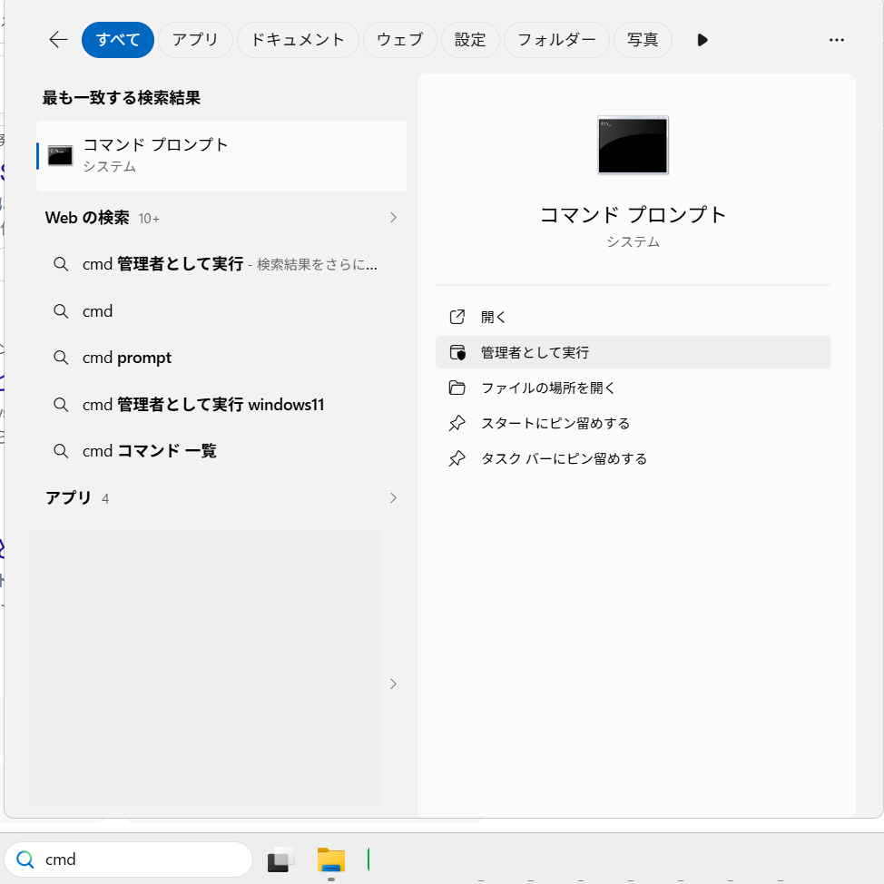
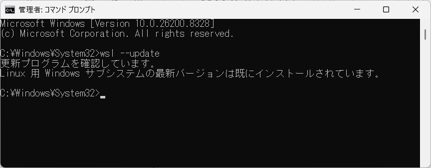
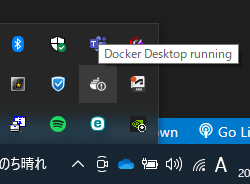
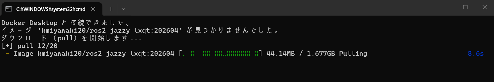
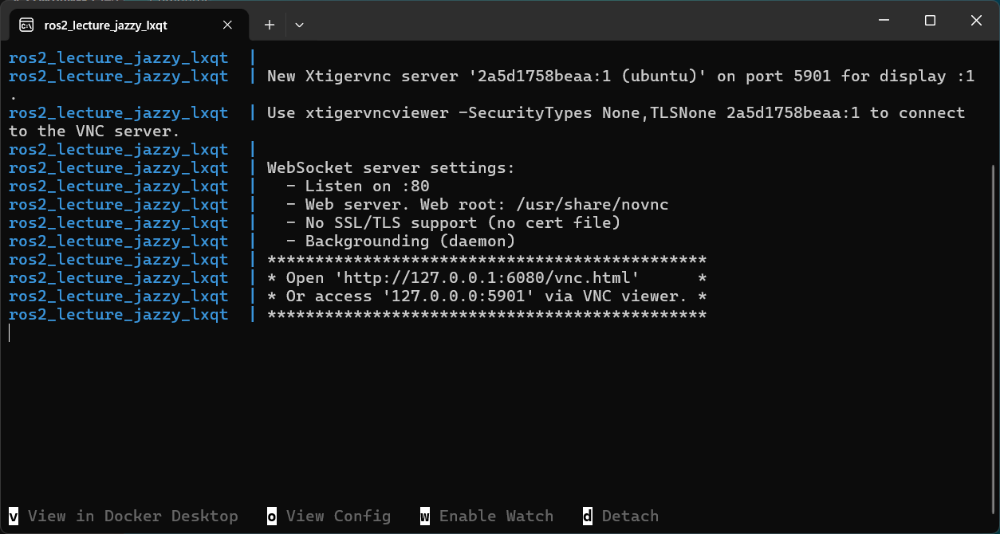
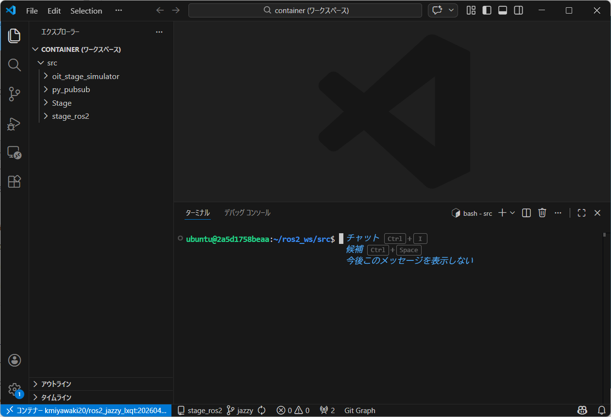
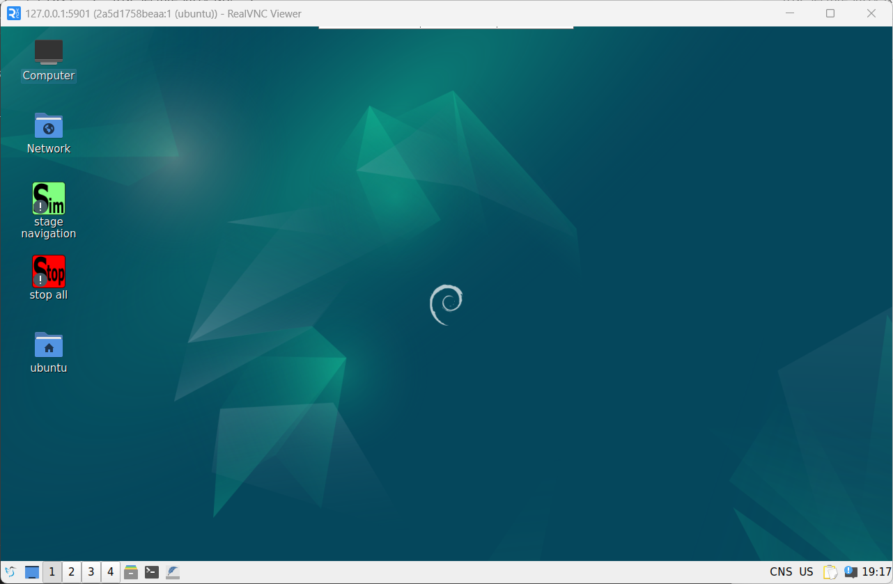
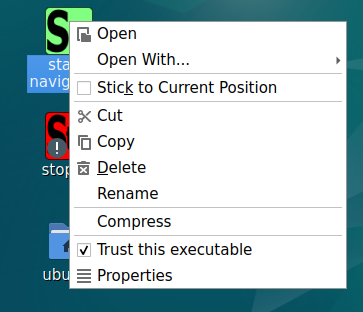

# ROS2プログラミング開発環境

このページでは`Docker`を使った`ROS2`開発環境のインストール方法をご案内しています。

本開発環境で使用しているソフトウェアは世間一般で広く利用されているものです。また、構築した環境も担当講師が実際に動作確認してはいますが、残念ながら全てのPCにおいて安全な動作を保証することはできません。  
掲載された内容によって生じた損害等の一切の責任を負いかねますので、ご了承ください。不安がある場合は重要なファイル等のバックアップをされた上で実施されることをお勧めいたします。

- [ROS2プログラミング開発環境](#ros2プログラミング開発環境)
  - [必要なソフトのインストールと事前準備](#必要なソフトのインストールと事前準備)
  - [Docker イメージのインストール](#docker-イメージのインストール)
  - [終了](#終了)
  - [２回目以降の起動](#２回目以降の起動)
  - [シミュレータの起動](#シミュレータの起動)

## 必要なソフトのインストールと事前準備

`Windows`の[アプリ検索](https://support.microsoft.com/ja-jp/windows/%E3%81%99%E3%81%B9%E3%81%A6%E3%81%AE%E3%82%A2%E3%83%97%E3%83%AA%E3%81%A8%E3%83%97%E3%83%AD%E3%82%B0%E3%83%A9%E3%83%A0%E3%82%92%E6%A4%9C%E7%B4%A2%E3%81%99%E3%82%8B-cadb9c4b-459d-dfcb-2964-14aac1d7d964)から`cmd`と入力しコマンドプロンプトを「管理者として実行」してください。



`wsl --update`と入力して`Enter`を押してください。



下記のソフトをインストールしてください。

1. [`Docker Desktop for Windows`](https://www.docker.com/products/docker-desktop/)
    - インターネット上に[インストール方法の日本語解説](https://docs.docker.jp/desktop/install/windows-install.html)もあります。
    - `WSL2(Windows Subsystem for Linux 2)`を併用する方法でインストールしてください。
2. [`Visual Studio Code`](https://code.visualstudio.com/)
    - 以降、VSCodeと表記します。
3. [`Real VNC`](https://www.realvnc.com/en/connect/download/viewer/)
    - リモートデスクトップのソフトです。

ファイルの拡張子を表示するようにしてください。

[ファイルの拡張子を表示させる / 全てのファイルを表示させる方法](https://success.trendmicro.com/ja-JP/solution/KA-0001221)

## Docker イメージのインストール

Wifi通信の良好な環境にて実施してください。

[ros2_lecture_jazzy_lxqt-main.zip](https://github.com/KMiyawaki/ros2_lecture_jazzy_lxqt/archive/refs/heads/main.zip)をダウンロードし展開してください。ここでは`%USERPROFILE%\Documents\ros2_lecture_jazzy_lxqt-main`に展開したとします。

**`%USERPROFILE%\Documents\ros2_lecture_jazzy_lxqt-main\ros2_lecture_jazzy_lxqt-main`のようにフォルダ名が２重になっていないことを十分に確認してください。**

なお、`%USERPROFILE%`は`Windows`の環境変数で`C:\Users\[ログインユーザ名]`に置き換えられます。  
`Windows`のファイルエクスプローラーでアドレス欄に`%USERPROFILE%\Documents`と入力してエンターキーを押し、どのフォルダが開くかを確認してみてください。
`C:\Users\[ログインユーザ名]\Documents`が開くはずです。


展開後のフォルダには以下のファイルが含まれています。

```text
127.0.0.1-5901.vnc
container.code-workspace.template
docker-compose.override.yaml.template
docker-compose.yml
images
README.md
share
start_all.bat.template
```

まず、`start_all.bat.template`をコピーして`start_all.bat`と名前を変更してください。

次に[Docker Desktop for Windows](https://docs.docker.com/desktop/install/windows-install/)が**起動していることを必ず確認してください**。

以下の画面のようにWindowsのタスクトレイに`Docker Desktop for Windows`のアイコンが表示されていることを確認し、次の手順に移ってください。  
アイコンの表示が無ければ、`Windows`の[アプリ検索](https://support.microsoft.com/ja-jp/windows/%E3%81%99%E3%81%B9%E3%81%A6%E3%81%AE%E3%82%A2%E3%83%97%E3%83%AA%E3%81%A8%E3%83%97%E3%83%AD%E3%82%B0%E3%83%A9%E3%83%A0%E3%82%92%E6%A4%9C%E7%B4%A2%E3%81%99%E3%82%8B-cadb9c4b-459d-dfcb-2964-14aac1d7d964)で`Docker Desktop for Windows`を検索して実行してください。



`Docker Desktop for Windows`の起動を確認できたら`%USERPROFILE%\Documents\ros2_lecture_jazzy_lxqt-main`において、先ほど作成した`start_all.bat`をダブルクリックしてください。

以下の画面のように環境のダウンロードが始まります。
このダウンロードは初回起動時のみです。



しばらくすると、以下の３つのウィンドウが開きます。

- コマンドプロンプト



- `VSCode`



- `Linux`のデスクトップ画面が表示された`Real VNC`。以降「`Linux`デスクトップ」と呼びます。



`Linux`デスクトップ上の「！」マークのついた二つのアイコンを右クリックし`Trust this executable`にチェックを入れてください。
この操作は初回起動時のみです。



## 終了

`VSCode`と`Linux`デスクトップを閉じ、コマンドプロンプトで`Ctrl`キーと`C`キーを同時に押してください。

もし、終了しなければ２，３回`Ctrl`キーと`C`キーを同時に押してください。それでも終了しない場合は起動コマンドを実行したコマンドプロンプトを閉じてください。

## ２回目以降の起動

`Docker Desktop for Windows`が起動していることを確認してから、`start_all.bat`をダブルクリックしてください。

## シミュレータの起動

デスクトップ上の`Sim`という緑色のアイコンをダブルクリックしてください。
以降は[oit_stage_simulator](https://github.com/KMiyawaki/oit_stage_simulator)に従ってください。
